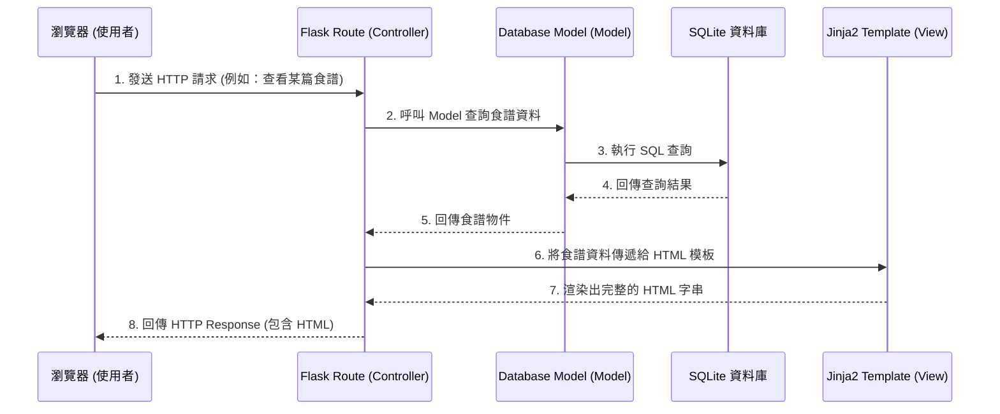

# 食譜收藏夾系統架構文件 (Architecture)

## 1. 技術架構說明

本系統為一個基於伺服器端渲染 (Server-Side Rendering, SSR) 的 Web 應用程式，並未採用前後端分離的架構。所有頁面的渲染與資料庫操作均由後端統一處理，能有效降低開發初期與部署的複雜度。

### 選用技術與原因
- **後端框架：Flask (Python)** 
  - **原因**：輕量且具高度彈性，學習曲線平緩，非常適合用來快速打造 MVP (Minimum Viable Product)。
- **模板引擎：Jinja2**
  - **原因**：內建於 Flask 生態系中，能夠無縫將後端資料注入 HTML，提供動態網頁渲染能力。
- **資料庫：SQLite (透過 SQLAlchemy 或 sqlite3 原生模組)**
  - **原因**：無需額外安裝並維護資料庫伺服器，資料儲存於本地單一檔案中，適合中小型應用與初期開發。

### MVC 模式對應說明
系統採用類似 MVC (Model-View-Controller) 的概念來組織程式碼：
- **Model (模型)**：對應 `app/models/`，負責定義資料結構（如：食譜、分類、評論）以及與 SQLite 資料庫的溝通。
- **View (視圖)**：對應 `app/templates/` 與 `app/static/`，負責網頁呈現與使用者介面。Jinja2 負責將資料填入 HTML 模板。
- **Controller (控制器)**：對應 `app/routes/`，負責接收瀏覽器的 HTTP 請求，調用對應的 Model 取得或寫入資料，最後將結果傳遞給 View 進行渲染。

## 2. 專案資料夾結構

以下為建議的資料夾樹狀結構：

```text
web_app_development2/
├── app/
│   ├── __init__.py      # Flask 應用程式初始化、套件與設定註冊
│   ├── models/          # 資料庫模型 (Model)
│   │   ├── recipe.py    # 食譜相關的資料結構與邏輯
│   │   └── category.py  # 分類相關的資料結構與邏輯
│   ├── routes/          # Flask 路由 (Controller)
│   │   ├── index.py     # 首頁相關路由
│   │   └── recipe.py    # 食譜增刪改查、評分相關路由
│   ├── templates/       # Jinja2 HTML 模板 (View)
│   │   ├── base.html    # 共用版型（包含導覽列、頁尾）
│   │   ├── index.html   # 首頁（食譜列表）
│   │   ├── detail.html  # 食譜詳細頁面（材料、步驟、營養資訊、評論）
│   │   └── form.html    # 新增/編輯食譜表單頁面
│   └── static/          # CSS / JS / 圖片靜態資源
│       ├── css/
│       │   └── style.css
│       └── images/      # 食譜封面圖片上傳存放區
├── docs/                # 專案文件 (PRD, 架構文件等)
├── instance/
│   └── database.db      # SQLite 資料庫檔案
├── app.py               # 專案入口點，負責啟動 Flask 伺服器
└── requirements.txt     # Python 依賴套件清單
```

## 3. 元件關係圖

以下展示使用者從瀏覽器發出請求，到系統內部處理流程，最後回傳畫面的過程。



## 4. 關鍵設計決策

1. **採用藍圖 (Blueprints) 拆分路由**
   - **原因**：為了避免所有的路由都寫在同一個檔案（如 `app.py`）中導致難以維護，我們將路由按功能（如 `index` 和 `recipe`）拆分到 `app/routes/` 下的不同檔案中，再於 `__init__.py` 中註冊。
2. **靜態檔案與上傳圖片分離**
   - **原因**：將使用者上傳的食譜圖片與系統預設的 CSS/JS 區分開來。建議將上傳圖片存放於 `app/static/images/`，並在資料庫中僅儲存圖片的相對路徑。
3. **資料庫 ORM 選擇**
   - **原因**：為了加速開發與降低 SQL 撰寫錯誤，建議使用 **Flask-SQLAlchemy**。這能讓開發者用 Python 物件的方式操作資料，且未來若需更換為其他關聯式資料庫（如 PostgreSQL），遷移成本較低。
4. **單一共用版型 (`base.html`)**
   - **原因**：利用 Jinja2 的模板繼承特性（``），所有頁面共享統一的導覽列與頁腳，減少重複程式碼，確保全站設計風格一致。
