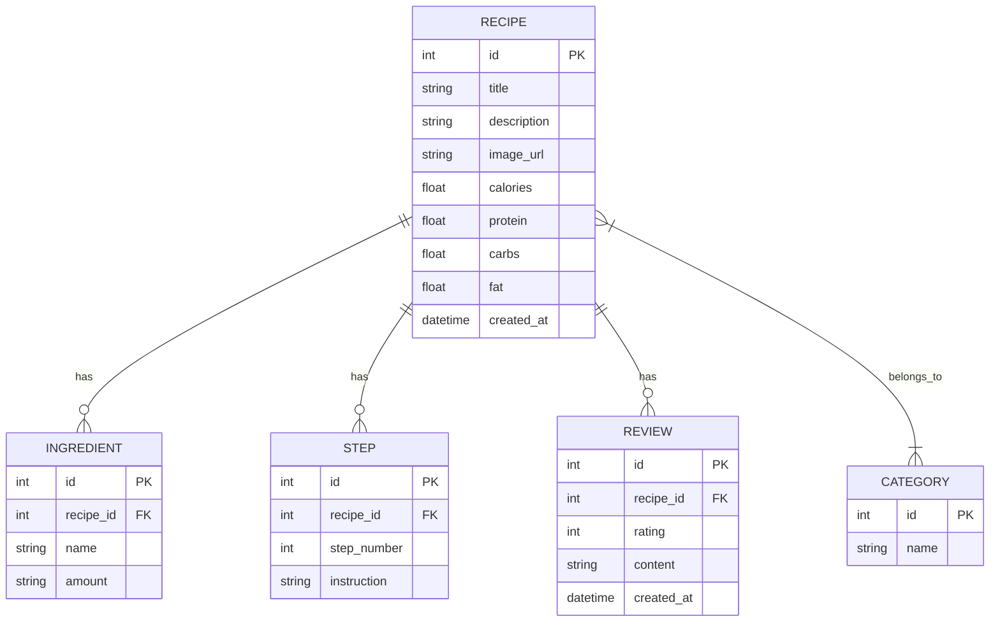

# 資料庫設計文件 (DB Design)

## 1. ER 圖（實體關係圖）

## 2. 資料表詳細說明

### recipes (食譜表)
負責儲存食譜的基本資料與營養資訊。
- `id` (INTEGER): 主鍵，自動遞增。
- `title` (VARCHAR): 食譜名稱，必填。
- `description` (TEXT): 食譜簡介，選填。
- `image_url` (VARCHAR): 封面圖片路徑，選填。
- `calories` (FLOAT): 卡路里估算值，選填。
- `protein` (FLOAT): 蛋白質估算值，選填。
- `carbs` (FLOAT): 碳水化合物估算值，選填。
- `fat` (FLOAT): 脂肪估算值，選填。
- `created_at` (DATETIME): 建立時間，預設為當下。

### categories (分類表)
儲存食譜的分類標籤（如：甜點、主食）。
- `id` (INTEGER): 主鍵，自動遞增。
- `name` (VARCHAR): 分類名稱，必填且唯一。

### recipe_category (食譜與分類關聯表)
處理食譜與分類間的「多對多」關聯。
- `recipe_id` (INTEGER): 外鍵，對應 recipes.id。
- `category_id` (INTEGER): 外鍵，對應 categories.id。
- 複合主鍵為 (recipe_id, category_id)。

### ingredients (材料表)
記錄每道食譜所需的材料清單。
- `id` (INTEGER): 主鍵，自動遞增。
- `recipe_id` (INTEGER): 外鍵，關聯到 recipes.id，必填。
- `name` (VARCHAR): 材料名稱，必填。
- `amount` (VARCHAR): 份量大小（例如：200g, 1大匙），必填。

### steps (步驟表)
記錄食譜的操作步驟與順序。
- `id` (INTEGER): 主鍵，自動遞增。
- `recipe_id` (INTEGER): 外鍵，關聯到 recipes.id，必填。
- `step_number` (INTEGER): 步驟順序，必填。
- `instruction` (TEXT): 步驟詳細說明，必填。

### reviews (評論表)
使用者留下的評分與心得。
- `id` (INTEGER): 主鍵，自動遞增。
- `recipe_id` (INTEGER): 外鍵，關聯到 recipes.id，必填。
- `rating` (INTEGER): 評分 (1~5)，必填。
- `content` (TEXT): 文字評論，選填。
- `created_at` (DATETIME): 建立時間，預設為當下。

## 3. SQL 建表語法
請參閱 `database/schema.sql` 中的完整 SQLite 語法。

## 4. Python Model 程式碼
基於架構文件所決定的 Flask-SQLAlchemy 開發，Model 程式碼位於 `app/models/`，並包含必要的 CRUD 方法：
- `app/models/__init__.py`: 初始化資料庫實例 `db`。
- `app/models/recipe.py`: 包含 Recipe, Ingredient, Step, Review, 以及 recipe_category 多對多關聯的定義與 CRUD。
- `app/models/category.py`: 包含 Category 的定義與 CRUD。
