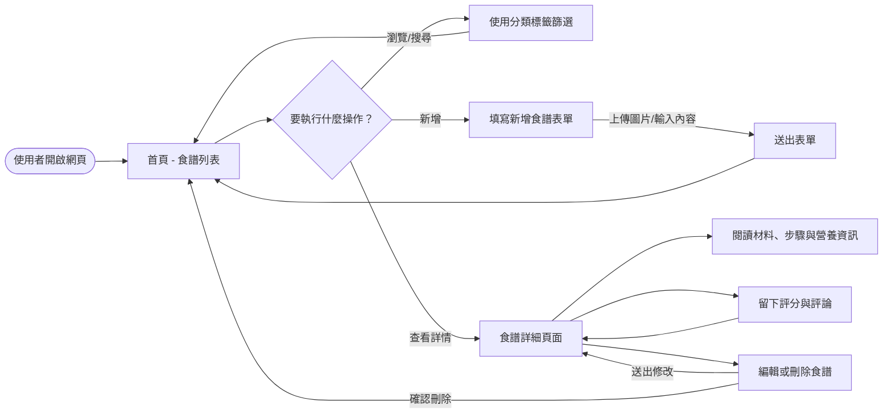
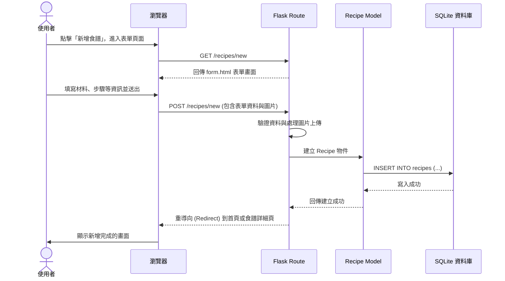

# 食譜收藏夾系統流程圖 (Flowchart)

根據系統的需求與架構設計，以下是食譜收藏夾系統的使用者流程圖、系統序列圖以及功能與路由的對照表。

## 1. 使用者流程圖 (User Flow)

此流程圖展示了使用者在網站中的主要操作路徑，包含瀏覽、新增、查看細節與分類篩選。

## 2. 系統序列圖 (Sequence Diagram)

此序列圖展示了「使用者新增食譜」的完整系統資料流，從前端表單送出到資料存入 SQLite 的過程。

## 3. 功能清單對照表

以下是系統主要功能與對應的 URL 路徑及 HTTP 方法規劃：

| 功能名稱 | 說明 | HTTP 方法 | URL 路徑 |
|---------|------|----------|----------|
| 瀏覽首頁 | 顯示所有食譜列表（可依分類篩選） | `GET` | `/` 或 `/recipes` |
| 新增食譜表單 | 顯示填寫食譜資訊的頁面 | `GET` | `/recipes/new` |
| 儲存新食譜 | 接收表單資料並存入資料庫 | `POST` | `/recipes/new` |
| 食譜詳細頁 | 顯示材料、步驟、營養資訊與評論 | `GET` | `/recipes/<id>` |
| 編輯食譜表單 | 顯示修改食譜的頁面 | `GET` | `/recipes/<id>/edit` |
| 更新食譜 | 接收修改後的資料並更新資料庫 | `POST` | `/recipes/<id>/edit` |
| 刪除食譜 | 從系統中移除該食譜 | `POST` | `/recipes/<id>/delete` |
| 新增評論與評分 | 在單一食譜下留下文字與星數 | `POST` | `/recipes/<id>/reviews` |
